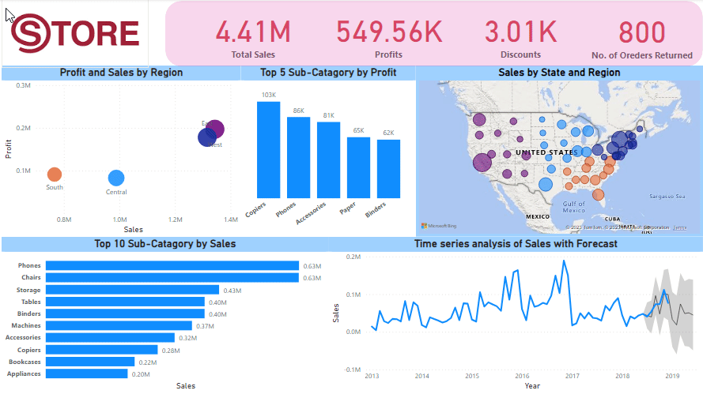
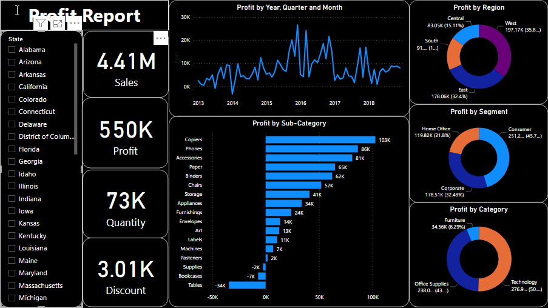

# Supermarket Analysis Project

## Introduction

In an era where data drives decision-making, understanding the dynamics of supermarket sales can be a game-changer for businesses seeking to optimize their operations and enhance customer experiences. This project delves into a rich dataset containing a plethora of information, from customer demographics to product details and transactional data.

.

## Project Objectives

The primary objectives of this project are as follows:

- **Sales Trends** : Explore the sales data to identify patterns, trends, and seasonal variations.
- **Customer Segmentation** : Gain insights into different customer segments and their buying behaviors.
- **Product Profiling** : Determine the profitability of various products and categories.
- **Discount Impact** : Assess how discounts affect sales and profitability.
- **Visual Representation** : Create visually appealing and informative charts and graphs to convey findings effectively.
## Data 

The [dataset](data/data123.xlsx) used in this project contains information related to supermarket sales transactions located in USA. It includes a total of 21 columns, such as Order ID, Order Date, Ship Date, Ship Mode, Customer information, Product details, and Sales-related metrics
Further information about data is [here](data/data_info.txt)

## Visualization

Visual representations of key findings using charts, graphs, and plots. Visualizations help in presenting data-driven insights in a more accessible and understandable manner. All the plots can be found [here.](https://github.com/mit4/Supermarket-Analysis/tree/8b9602468483525c02553c935fd41462b498a2e2/reports/figures)

## Why Supermarket Analysis Matters

Understanding the nuances of supermarket sales is crucial for several reasons:

**Data-Driven Decision Making** : Data insights can help supermarket owners and managers make informed decisions regarding inventory, marketing strategies, and customer engagement.

**Customer Satisfaction** : Knowing what products are in demand and catering to customer preferences can lead to higher customer satisfaction and loyalty.

**Profitability** : By identifying high-margin products and optimizing pricing strategies, supermarkets can increase their profitability.

**Competitive Edge**: In a competitive market, supermarkets that harness the power of data analytics gain a competitive edge over their peers.

## Get Involved
We encourage you to explore the project's findings, visualizations, and insights. Your contributions, feedback, and suggestions are highly valued. Together, we can uncover the hidden gems within this supermarket dataset and gain a deeper understanding of the retail landscape.

Thank you for being a part of the Supermarket Analysis Project!